# 🧠 Cognitive Loops

## The Three Loops of Intelligence

Our system operates through three interconnected cognitive loops that mirror how successful product organizations think and operate.

```mermaid
graph TB
    subgraph "🎯 Demand Loop"
        P[Prospect] --> U[User]
        U --> B[Buyer]
        B --> A[Advocate]
    end
    
    subgraph "🔨 Production Loop"
        BR[BacklogReader] --> C[Creator]
        C --> E[Editor]
        E --> R[Reviewer]
        R --> M[Merger]
    end
    
    subgraph "📊 Learning Loop"
        Mon[Monitor] --> An[Analyst]
        An --> Mem[Memory]
        Mem --> Ev[Evolver]
    end
    
    A --> BR
    M --> Mon
    Ev --> P
```



## 1. Demand Loop - "What Should We Build?"

### Purpose
Identifies and validates what truly matters to build. This loop generates the **intent** behind our work.

### Agents

#### Prospect Agent
- **Question**: "Why do I care?"
- **Function**: Identifies pain points and opportunities
- **Output**: Problem statements with clear "why"

#### User Agent  
- **Question**: "How do I try it?"
- **Function**: Explores solution space from user perspective
- **Output**: Friction points and desired outcomes

#### Buyer Agent
- **Question**: "Is it worth it?"
- **Function**: Evaluates ROI and priority
- **Output**: Value assessments and priorities

#### Advocate Agent
- **Question**: "Is it worth sharing?"
- **Function**: Amplifies valuable solutions
- **Output**: Validated backlog items

## 2. Production Loop - "How Do We Build It?"

### Purpose
Transforms validated needs into working software through disciplined engineering.

### Agents

#### BacklogReader Agent
- **Function**: Selects next safe, valuable work
- **Safety**: Validates all safety constraints
- **Output**: Selected issue with risk assessment

#### Creator Agent
- **Function**: Generates initial solution
- **Approach**: Creative problem-solving focus
- **Output**: Draft PR with working code

#### Editor Agent
- **Function**: Refines to production quality
- **Focus**: Tests, documentation, standards
- **Output**: Polished PR ready for review

#### Reviewer Agent
- **Function**: Quality gate and approval
- **Criteria**: Code quality, tests, safety, business logic
- **Output**: Approval or revision requests

#### Merger Agent
- **Function**: Safe deployment to staging
- **Checks**: CI/CD, conflicts, deployment health
- **Output**: Merged PR and deployment status

## 3. Learning Loop - "How Do We Improve?"

### Purpose
Observes outcomes and evolves the system's understanding and capabilities.

### Agents

#### Monitor Agent
- **Function**: Tracks deployment health
- **Metrics**: Error rates, performance, user impact
- **Output**: Health reports and alerts

#### Analyst Agent
- **Function**: Generates insights from outcomes
- **Analysis**: What worked, what didn't, why
- **Output**: Actionable insights

#### Memory Agent
- **Function**: Stores learned patterns
- **Storage**: Success patterns, failure modes
- **Output**: Updated knowledge base

#### Evolver Agent
- **Function**: Updates agent strategies
- **Evolution**: Adjusts weights, criteria, patterns
- **Output**: Improved decision-making

## Loop Interactions

### Demand → Production
- Advocate validates and prioritizes work
- BacklogReader selects from validated items
- Clear handoff through Linear issues

### Production → Learning
- Merger completes deployment
- Monitor tracks outcomes
- Automatic trigger on deployment

### Learning → Demand
- Evolver updates Prospect's value model
- Memory informs User's friction detection
- Continuous improvement cycle

## Implementation in LangGraph

```python
# Simplified loop connection
cognitive_system = StateGraph(CognitiveState)

# Add loops as subgraphs
cognitive_system.add_node("demand_loop", create_demand_loop())
cognitive_system.add_node("production_loop", create_production_loop())
cognitive_system.add_node("learning_loop", create_learning_loop())

# Connect loops
cognitive_system.add_edge("demand_loop", "production_loop")
cognitive_system.add_edge("production_loop", "learning_loop")
cognitive_system.add_edge("learning_loop", "demand_loop")
```

## Key Benefits

1. **Separation of Concerns** - Each loop has a clear purpose
2. **Natural Feedback** - Learning improves all loops
3. **Fault Isolation** - Issues in one loop don't break others
4. **Scalability** - Add agents without changing structure
5. **Observability** - Clear flow of decisions and data 