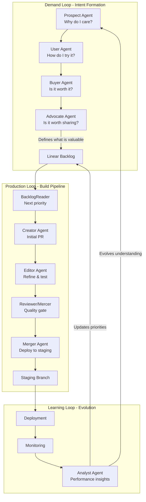

# Autonomous PR System - Implementation Plan

## 🎯 Executive Summary

We are building an **autonomous agent system** that mimics the cognitive and operational structure of a **real-world product organization**. This self-improving engineering org in a box:

- **Knows WHY it builds** (Demand Loop: Prospect → User → Buyer → Advocate)
- **Knows WHAT to build** (Validated needs from Linear backlog)
- **Knows HOW to build** (Production Loop: Creator → Editor → Reviewer → Merger)
- **Learns and improves** (Analyst feeds insights back to Prospect)

**Core Principle**: The system operates autonomously on `staging` but requires human approval for `main`.

### System Philosophy
Each agent represents a function of cognition:
- **Goal-seeking**: Prospect and User agents identify what matters
- **Evaluation**: Buyer and Reviewer agents assess worth and quality
- **Execution**: Creator and Builder agents implement solutions
- **Learning**: Analyst agent evolves understanding through feedback

### 🔒 Critical Safety Rules

#### Branch Protection
- **NEVER** push to: `main`, `master`, `staging`, `production`, `prod`
- **NEVER** merge pull requests to main or production
- **ONLY** work on feature branches (format: `auto/issue-id`)
- **ALWAYS** check branch name before any git operations

#### Code Safety
- **NEVER** delete production code without explicit confirmation
- **NEVER** modify critical infrastructure files (`.env`, `docker-compose.yml`, etc.)
- **NEVER** expose secrets, API keys, or credentials in code or logs
- **ALWAYS** validate inputs and handle edge cases defensively

#### User Issue Protection
- **NEVER** modify user-created issues without explicit permission
- **ALWAYS** identify AI-generated vs user-created issues
- **REQUIRE** clear AI markers on all agent-created issues
- **DEFAULT** to protection when issue origin is unclear

---

## 🏗️ Architecture Principles

### Keep It Simple
- **Prefer** simple, readable solutions over clever abstractions
- **Avoid** over-engineering - the agent should be maintainable
- **Use** existing libraries rather than reimplementing functionality
- **Document** complex logic with clear comments

### Single Responsibility
- Each function should do ONE thing well
- Keep functions under 50 lines when possible
- Extract complex logic into well-named helper functions

---

## 📊 System Architecture

### Cognitive Organization Structure



### Feedback-Fed Machine
The system creates a **closed cognitive loop** where:
1. **Demand defines value** through simulated human needs
2. **Production delivers value** through autonomous code generation
3. **Analysis refines understanding** through outcome observation
4. **Evolution improves selection** through feedback integration

---

## 🔧 Phase 0: Foundation Setup (Week 1)

### Infrastructure Requirements
- [ ] **Git Integration**
  - GitHub API access tokens
  - Branch protection rules (staging auto-merge allowed, main protected)
  - PR templates and labels

- [ ] **Linear Integration**
  - API keys and workspace setup
  - Custom fields for agent metadata
  - Webhook configuration for real-time updates
  - Configure workflow states and transitions
  - Set up quality gate validation

- [ ] **Monitoring Stack**
  - Vercel API integration
  - Sentry project setup with alerts
  - Datadog/CloudWatch for system metrics

- [ ] **Agent Framework**
  ```python
  # Core agent interface
  class BaseAgent:
      def __init__(self, state: SharedState):
          self.state = state
          self.logger = self.setup_logging()
      
      async def execute(self) -> AgentResult:
          raise NotImplementedError
      
      def validate_constraints(self) -> bool:
          # Safety checks before execution
          pass
  ```

---

## 📋 Phase 1: Backlog Execution Loop (Week 2-3)

### 1.1 BacklogReader Agent
**Purpose**: Intelligently select next task from Linear

**Linear Workflow Authority**:
- ✅ **CAN**: `Backlog` → `Backlog` (estimate & refine)
- ✅ **CAN**: `Backlog` → `Awaiting Approval` (quality gates pass)
- ✅ **CAN**: `Ready for Dev` → `Backlog` (quality gates fail)
- ❌ **CANNOT**: `Backlog` → `Ready for Dev` (human prioritization only)
- ❌ **CANNOT**: `Awaiting Approval` → Assignment (human approval only)

**Quality Gate Requirements**:
- 🔢 **Fibonacci Estimate** (1,2,3,5,8,13,21) - MANDATORY
- 📋 **Acceptance Criteria** - Structured, testable conditions
- 📝 **Clear Technical Details** - Implementation context
- 🎯 **Unambiguous Requirements** - High developer confidence

**Implementation**:
```python
class BacklogReaderAgent(BaseAgent):
    def select_next_task(self):
        # Priority algorithm:
        # 1. Critical bugs (P0)
        # 2. User-reported issues with high impact
        # 3. Small, well-defined features
        # 4. Tech debt with clear ROI
        
        # Filters:
        # - Must have clear acceptance criteria
        # - Must have Fibonacci estimate
        # - Estimated < 8 story points
        # - No external dependencies
        # - Not blocked by other issues
        # - In "Ready for Dev" state only
```

**Safety Rules**:
- Skip tasks requiring database migrations
- Skip tasks modifying authentication/authorization
- Skip tasks touching payment systems
- Require explicit "auto-pr-safe" label
- Never modify user-created issues

### 1.2 Creator Agent
**Purpose**: Initial code generation - the creative spark
**Cognitive Function**: Synthesis and creation

**Implementation**:
```python
class CreatorAgent(BaseAgent):
    """Writes the initial PR - focuses on solving the problem"""
    
    async def create_initial_solution(self, task: LinearTask):
        # Creative process: problem → solution
        solution_approach = await self.ideate_solution(task)
        
        # Generate initial implementation
        code = await self.generate_code(solution_approach)
        
        # Don't over-optimize - that's Editor's job
        return self.create_draft_pr(code)
```

### 1.3 Editor Agent
**Purpose**: Refine and polish the Creator's work
**Cognitive Function**: Refinement and quality improvement

**Implementation**:
```python
class EditorAgent(BaseAgent):
    """Improves code quality, adds tests, ensures standards"""
    
    async def refine_pr(self, draft_pr):
        # Add comprehensive tests
        tests = await self.generate_tests(draft_pr)
        
        # Improve code quality
        refined_code = await self.enhance_code_quality(draft_pr)
        
        # Ensure documentation
        docs = await self.update_documentation(draft_pr)
        
        return self.create_polished_pr(refined_code, tests, docs)
```

### 1.4 Reviewer Agent (Mercer)
**Purpose**: Quality gate and approval
**Cognitive Function**: Evaluation and validation

**Review Framework**:
- Code quality and conventions
- Test coverage and robustness
- Security and performance
- Business logic correctness
- Impact assessment

### 1.5 Merger Agent
**Purpose**: Safe merging to staging

**Pre-merge Validation**:
- All CI/CD checks pass
- No merge conflicts
- Deployment preview builds successfully
- No critical Sentry errors in last hour

---

## 🧠 Phase 2: Demand Loop - Cognitive Intent Formation (Week 4-5)

### 2.1 Prospect Agent - "Why do I care?"
**Cognitive Function**: Goal-seeking and need identification
**Purpose**: Discovers what truly matters to the system

**Implementation**:
```python
class ProspectAgent(BaseAgent):
    """Identifies core needs and pains - the 'why' behind building"""
    
    async def identify_needs(self):
        # Sources of "pain" or opportunity
        pain_signals = await self.gather_pain_signals()
        
        # Cognitive evaluation: What matters most?
        prioritized_needs = self.evaluate_importance(pain_signals)
        
        # Output: Clear problem statements
        return self.formulate_problems(prioritized_needs)
```

**Outputs**: Problem statements with clear "why" → Linear backlog

### 2.2 User Agent - "How do I try it?"
**Cognitive Function**: Exploration and experimentation
**Purpose**: Simulates trying to solve the identified problem

**Implementation**:
```python
class UserAgent(BaseAgent):
    """Simulates usage patterns and reveals friction"""
    
    async def explore_solution_space(self, problem):
        # Try different approaches
        attempts = await self.simulate_user_attempts(problem)
        
        # Identify friction points
        friction_points = self.analyze_difficulties(attempts)
        
        # Cognitive insight: What would make this easier?
        return self.suggest_improvements(friction_points)
```

### 2.3 Buyer Agent - "Is it worth it?"
**Cognitive Function**: Evaluation and decision-making
**Purpose**: Cost/benefit analysis of proposed solutions

**Decision Framework**:
- Effort required vs. impact delivered
- Risk assessment
- Opportunity cost
- Strategic alignment

### 2.4 Advocate Agent - "Is it worth sharing?"
**Cognitive Function**: Value amplification and communication
**Purpose**: Makes the case for why this matters to others

**Actions**:
- Crafts compelling narratives
- Quantifies impact
- Builds consensus
- Creates urgency when appropriate

---

## 🔄 The Cognitive Feedback Loop

### How the System Learns and Evolves

```python
class CognitiveFeedbackLoop:
    """The brain of our autonomous engineering org"""
    
    def __init__(self):
        self.demand_loop = DemandLoop()
        self.production_loop = ProductionLoop()
        self.memory = LongTermMemory()
    
    async def run_cycle(self):
        # 1. Demand Loop generates intent
        need = await self.demand_loop.identify_next_need()
        
        # 2. Production Loop executes
        result = await self.production_loop.build_solution(need)
        
        # 3. Analyst observes outcomes
        insights = await self.analyze_results(result)
        
        # 4. System evolves
        await self.evolve_understanding(insights)
        
    async def evolve_understanding(self, insights):
        """The key to self-improvement"""
        # Update Prospect's understanding of what matters
        self.demand_loop.prospect.update_value_model(insights)
        
        # Improve Builder's code patterns
        self.production_loop.builder.learn_patterns(insights)
        
        # Refine Reviewer's quality criteria
        self.production_loop.reviewer.adjust_standards(insights)
        
        # Store in long-term memory
        await self.memory.store_learning(insights)
```

### Mimicking a Real Product Organization

| Human Role | Agent Equivalent | Cognitive Function |
|------------|------------------|-------------------|
| Product Manager | Prospect + Buyer | Identifies needs, prioritizes |
| User Researcher | User Agent | Explores problem space |
| Developer | Creator + Builder | Implements solutions |
| Code Reviewer | Editor + Reviewer | Ensures quality |
| DevOps | Merger + Monitor | Deploys and observes |
| Data Analyst | Analyst Agent | Learns from outcomes |
| Evangelist | Advocate Agent | Amplifies value |

---

## 🛡️ Safety & Monitoring Systems

### Deployment Monitor
```python
class DeploymentMonitor:
    async def check_health(self, deployment_id: str):
        # 1. Vercel deployment status
        # 2. Application startup logs
        # 3. Sentry error rate (compare baseline)
        # 4. Core user flows (synthetic monitoring)
        # 5. Database query performance
        
        # Rollback triggers:
        # - Error rate > 5% increase
        # - P95 latency > 20% increase
        # - Any P0 errors
        # - Failed health checks
```

### Learning System
```python
class AnalystAgent(BaseAgent):
    def analyze_outcome(self, pr: PullRequest):
        # Track metrics:
        # - Time to resolve
        # - Code quality scores
        # - Post-deploy incidents
        # - User satisfaction changes
        
        # Update agent behaviors:
        # - Task selection weights
        # - Code patterns to avoid
        # - Testing strategies that work
```

---

## 📈 Implementation Timeline

### Week 1: Foundation
- Set up agent framework
- Configure Linear API integration
- Implement basic BacklogReader
- Create staging branch automation

### Week 2-3: Core Loop
- Builder Agent with Cursor integration
- Reviewer Agent with rule engine
- Merger Agent with safety checks
- Basic monitoring integration

### Week 4: Advanced Features
- Demand loop agents
- Learning/feedback system
- Advanced prioritization
- Performance optimization

### Week 5: Production Readiness
- Comprehensive testing
- Monitoring dashboards
- Runbook documentation
- Gradual rollout plan

---

## 🚀 Rollout Strategy

### Phase 1: Shadow Mode (Week 1)
- Agents run but don't create PRs
- Log all decisions for review
- Validate against human decisions

### Phase 2: Supervised Mode (Week 2-3)
- Create PRs but require human approval
- Track success metrics
- Refine decision algorithms

### Phase 3: Autonomous Staging (Week 4)
- Auto-merge to staging for safe issues
- Monitor closely for first 48 hours
- Implement circuit breakers

### Phase 4: Full Autonomy (Week 5+)
- Expand scope gradually
- Add more complex issue types
- Optimize for velocity + quality

---

## 📊 Success Metrics

### Velocity Metrics
- PRs created per day
- Time from issue → merged PR
- Backlog burndown rate

### Quality Metrics
- Post-merge incident rate
- Test coverage improvement
- Code review findings

### Learning Metrics
- Agent decision accuracy
- False positive rate
- Adaptation speed

---

## 🔒 Risk Mitigation

### Technical Risks
| Risk | Mitigation |
|------|------------|
| Bad code generation | Comprehensive test requirements |
| Infinite loops | Execution timeouts and counters |
| Merge conflicts | Rebase strategy and conflict detection |
| Performance regression | Automated performance testing |

### Business Risks
| Risk | Mitigation |
|------|------------|
| Breaking production | Staging-only automation |
| Security vulnerabilities | Security scanning in pipeline |
| Compliance violations | Allowlist of safe file types |
| Customer data exposure | Prohibit database schema changes |

---

## 🛠️ Technical Implementation Details

### State Management
```python
@dataclass
class SharedState:
    current_task: Optional[LinearTask]
    pr_history: List[PullRequest]
    deployment_status: DeploymentStatus
    learning_cache: Dict[str, Any]
    
    def checkpoint(self):
        # Persist state for crash recovery
        pass
```

### Communication Protocol
```python
class AgentBus:
    async def publish(self, event: AgentEvent):
        # Inter-agent communication
        # Audit trail
        # Real-time monitoring
        pass
```

### Observability
```python
class ObservabilityLayer:
    def trace_decision(self, agent: str, decision: Decision):
        # OpenTelemetry integration
        # Decision replay capability
        # Performance profiling
        pass
```

---

## 📚 Documentation Requirements

### For Operators
- System architecture diagrams
- Runbook for common issues
- Monitoring dashboard guide
- Emergency shutdown procedures

### For Developers
- Agent development guide
- Testing strategies
- Local development setup
- Contributing guidelines

### For Stakeholders
- ROI reports
- Risk assessment
- Capability roadmap
- Success stories

---

## 🎯 Next Steps

1. **Immediate Actions**
   - [ ] Review and approve this plan
   - [ ] Set up Linear API access
   - [ ] Create staging branch with protection rules
   - [ ] Initialize agent framework repository

2. **Week 1 Deliverables**
   - [ ] Working BacklogReader prototype
   - [ ] Basic Linear → PR pipeline
   - [ ] Monitoring dashboard v1
   - [ ] First autonomous PR on staging

3. **Success Criteria for Phase 1**
   - 5 PRs successfully merged to staging
   - Zero production incidents
   - 90% agent decision accuracy
   - Positive developer feedback

---

## 🔄 Continuous Improvement

This system will evolve through:
- Weekly retrospectives on agent performance
- A/B testing different strategies
- Incorporating new Linear fields/workflows
- Expanding to more complex issue types
- Cross-team knowledge sharing

The goal is not just automation, but building a **learning system** that gets better at software development over time.

---

## 🧠 Philosophy: Engineering Org in a Box

### The Vision
This system represents a fundamental shift in how we think about software development. It's not just automation - it's a **self-aware, self-improving engineering organization** that:

1. **Understands Intent**: Through the Demand Loop, it knows WHY something should be built
2. **Executes Efficiently**: Through the Production Loop, it knows HOW to build well
3. **Learns Continuously**: Through the Analyst feedback, it gets better every cycle
4. **Operates Autonomously**: It makes decisions like a skilled team would

### Cognitive Architecture
```
PERCEPTION → REASONING → ACTION → LEARNING
     ↑                                 ↓
     ←←←←←←← EVOLUTION ←←←←←←←←←←←←←←←
```

Each agent is a **function of cognition**:
- **Prospect**: Pattern recognition and goal formation
- **User**: Experiential learning and empathy
- **Buyer**: Resource optimization and prioritization
- **Advocate**: Communication and influence
- **Creator**: Synthesis and innovation
- **Editor**: Refinement and quality
- **Reviewer**: Validation and risk assessment
- **Analyst**: Reflection and insight generation

### The Endgame
When fully realized, this system will:
- Generate more code than human developers
- Maintain higher quality standards
- Learn from every success and failure
- Evolve its own architecture
- Eventually contribute to its own development

This is the foundation for **AI-native software development** - where the organization itself is code, and improvement is continuous and autonomous.

**Remember**: We're not building a tool. We're building a colleague that never sleeps, always learns, and continuously improves. 🤖✨ 