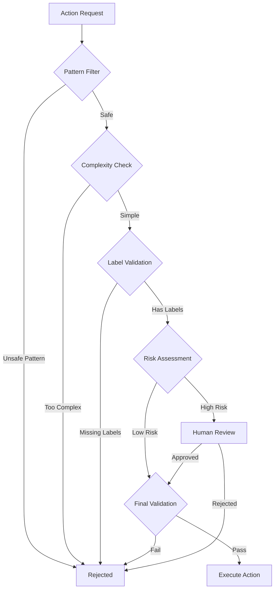

# 🛡️ Safety Design

## Safety Philosophy

Safety is not a feature - it's the foundation. Every action the system takes must pass through multiple safety gates designed to prevent harm while maintaining autonomy.

## Multi-Layer Safety Model



## Safety Layers

### 1. Pattern-Based Filtering

```python
UNSAFE_PATTERNS = [
    # Authentication & Security
    r"(?i)auth|login|security|password|oauth|jwt|token",
    r"(?i)permission|role|admin|sudo|root",
    
    # Financial & Payments
    r"(?i)payment|billing|stripe|subscription|invoice",
    r"(?i)credit.?card|bank|financial|money",
    
    # Data Operations
    r"(?i)delete|drop|truncate|destroy|remove",
    r"(?i)migration|database|schema|alter.?table",
    
    # Secrets & Configuration
    r"(?i)secret|key|credential|env|config",
    r"(?i)api.?key|private.?key|certificate",
    
    # User Data
    r"(?i)user.?data|personal|privacy|gdpr|pii",
    r"(?i)email|phone|address|ssn|identity"
]
```

### 2. Complexity Limits

| Metric | Safe Limit | Hard Limit |
|--------|------------|------------|
| Story Points | ≤ 3 | ≤ 5 |
| Files Changed | ≤ 5 | ≤ 10 |
| Lines Changed | ≤ 200 | ≤ 500 |
| Test Coverage | ≥ 80% | ≥ 60% |

### 3. Required Safety Labels

```yaml
required_labels:
  - name: "auto-pr-safe"
    description: "Explicitly marked safe for automation"
    
optional_safety_labels:
  - name: "ui-only"
    description: "Only touches UI components"
  - name: "test-only"
    description: "Only adds/modifies tests"
  - name: "docs-only"
    description: "Documentation changes only"
```

### 4. Human-in-the-Loop Gates

```python
class HumanApprovalGate:
    """When human review is mandatory"""
    
    MANDATORY_REVIEW_CONDITIONS = [
        "risk_level == 'critical'",
        "complexity_score > 8",
        "touches_protected_files",
        "first_time_file_pattern",
        "deployment_affects_payments",
        "error_rate_increase > 5%"
    ]
    
    INTERRUPT_POINTS = [
        "before_merge",        # Always pause before merge
        "before_deployment",   # Pause before production
        "after_error_spike",   # Pause on anomalies
        "on_rollback_needed"   # Pause when rollback detected
    ]
```

## Safe Operations Whitelist

### Allowed File Types
```python
SAFE_FILE_PATTERNS = [
    r"\.md$",                    # Markdown documentation
    r"\.test\.(js|ts|py)$",     # Test files
    r"components/.*\.tsx$",      # UI components
    r"styles/.*\.css$",          # Stylesheets
    r"locales/.*\.json$",        # Translations
    r"__tests__/.*",             # Test directories
]
```

### Allowed Operations
1. **UI Updates**: Text, labels, styling
2. **Test Addition**: New test files only
3. **Documentation**: README, comments, docs
4. **Refactoring**: With 100% test coverage
5. **Dependencies**: Patch updates only

## Rollback Strategy

### Automatic Rollback Triggers

```python
class RollbackTriggers:
    """Conditions that trigger automatic rollback"""
    
    METRICS = {
        "error_rate_increase": 5.0,      # 5% increase
        "response_time_increase": 20.0,   # 20% slower
        "availability_drop": 0.5,         # 0.5% drop
        "failed_health_checks": 3,        # 3 consecutive
    }
    
    PATTERNS = [
        "500_errors_spike",
        "database_connection_errors",
        "memory_leak_detected",
        "security_vulnerability_found"
    ]
```

### Rollback Procedure

1. **Detect anomaly** - Monitoring alerts trigger
2. **Pause all operations** - Stop current work
3. **Capture state** - Save for analysis
4. **Revert deployment** - Roll back to last good
5. **Notify humans** - Alert for investigation
6. **Enter safe mode** - Reduced autonomy until cleared

## Branch Protection

```yaml
protected_branches:
  main:
    - no_direct_push: true
    - require_pr: true
    - require_human_approval: true
    - require_ci_pass: true
    
  staging:
    - no_direct_push: true
    - require_pr: true
    - allow_auto_merge: true
    - require_ci_pass: true
    
  production:
    - no_direct_push: true
    - require_pr: true
    - require_human_approval: true
    - require_staging_success: true
```

## Emergency Controls

### Kill Switch

```python
class EmergencyStop:
    """Immediate system shutdown"""
    
    async def execute(self):
        # 1. Stop all agents
        await self.halt_all_agents()
        
        # 2. Cancel pending operations
        await self.cancel_pending_prs()
        
        # 3. Rollback active deployments
        await self.rollback_active_deployments()
        
        # 4. Enter maintenance mode
        await self.enable_maintenance_mode()
        
        # 5. Alert humans
        await self.send_emergency_alerts()
```

### Safe Mode

When activated, the system:
- Only reads, never writes
- Requires human approval for all actions
- Operates on test repositories only
- Logs all decisions without executing
- Runs health checks every minute

## Compliance & Audit

### Audit Trail

Every action logs:
```json
{
    "timestamp": "2024-01-01T00:00:00Z",
    "agent": "CreatorAgent",
    "action": "create_pr",
    "target": "issue/PROJ-123",
    "safety_checks": [
        {"name": "pattern_filter", "passed": true},
        {"name": "complexity", "passed": true, "score": 2},
        {"name": "labels", "passed": true}
    ],
    "human_approval": null,
    "result": "success",
    "pr_number": 456
}
```

### Compliance Checks

- **GDPR**: No personal data in logs
- **SOC2**: Full audit trail maintained
- **Security**: No secrets in code or state
- **Privacy**: User data never processed

## Testing Safety

### Safety Test Suite

```python
@pytest.mark.safety
class TestSafetyMechanisms:
    """Verify all safety systems work"""
    
    def test_rejects_auth_changes(self):
        """Should reject authentication modifications"""
        
    def test_complexity_limits(self):
        """Should enforce complexity boundaries"""
        
    def test_rollback_on_errors(self):
        """Should rollback when errors spike"""
        
    def test_human_gates(self):
        """Should pause for human approval"""
```

## Continuous Improvement

Safety rules evolve based on:
1. **Incident analysis** - Learn from failures
2. **False positive rate** - Reduce over-blocking
3. **New attack vectors** - Adapt to threats
4. **Team feedback** - Incorporate experience 