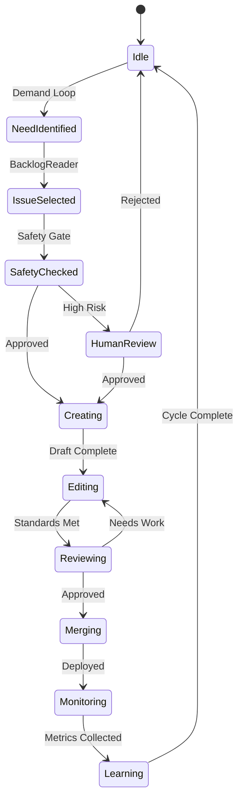

# 📊 State Management

## Overview

State management is the heart of our LangGraph implementation. The `CognitiveState` represents the complete mental model of our autonomous system at any point in time.

## Core State Schema

```python
from typing import TypedDict, Optional, List, Dict, Any, Literal
from datetime import datetime
from pydantic import BaseModel

class CognitiveState(TypedDict):
    """Complete system state - the 'mind' of our autonomous agent"""
    
    # Current Work Context
    current_issue: Optional[IssueMetadata]      # What we're working on
    current_pr: Optional[PRMetadata]            # Active pull request
    current_branch: Optional[str]               # Git branch context
    
    # Cognitive Memory (Demand Loop)
    identified_needs: List[NeedStatement]       # Problems worth solving
    user_friction_points: List[FrictionPoint]   # UX pain points
    value_assessments: List[ValueAssessment]    # ROI evaluations
    
    # Production State
    code_changes: Optional[CodeChangeSet]       # Proposed changes
    test_results: Optional[TestResults]         # Test execution results
    review_feedback: Optional[List[str]]        # Code review comments
    
    # Safety & Compliance
    safety_checks: List[SafetyCheck]            # All safety validations
    risk_level: RiskLevel                       # Current risk assessment
    compliance_status: ComplianceStatus         # Regulatory checks
    
    # Monitoring & Health
    deployment_status: Optional[str]            # Current deployment state
    error_rate: Optional[float]                 # Error rate baseline
    performance_metrics: Dict[str, float]       # Key performance indicators
    rollback_triggered: bool                    # Emergency state
    
    # Learning & Evolution
    insights: List[Insight]                     # Learned patterns
    success_patterns: List[Pattern]             # What works
    failure_patterns: List[Pattern]             # What to avoid
    
    # Control Flow
    next_action: str                            # Next step in workflow
    requires_human_approval: bool               # Human gate needed
    human_approval_reason: Optional[str]        # Why human needed
    
    # Execution Metadata
    cycle_count: int                            # How many cycles run
    execution_log: List[ExecutionEvent]         # Detailed trace
    error_log: List[ErrorEvent]                 # Error history
    checkpoint_id: Optional[str]                # Last checkpoint
```

## State Transitions

### Valid State Flows



## Checkpointing Strategy

### When We Checkpoint
1. **Before risky operations** - Pre-merge, pre-deployment
2. **After major decisions** - Issue selection, PR creation
3. **On state transitions** - Moving between loops
4. **Every N minutes** - Time-based backup

### Checkpoint Storage

```python
from langgraph.checkpoint.postgres import PostgresSaver

# PostgreSQL schema
"""
CREATE TABLE checkpoints (
    thread_id VARCHAR(255),
    checkpoint_id VARCHAR(255),
    parent_id VARCHAR(255),
    state JSONB,
    metadata JSONB,
    created_at TIMESTAMP DEFAULT CURRENT_TIMESTAMP,
    PRIMARY KEY (thread_id, checkpoint_id)
);
"""

checkpointer = PostgresSaver.from_conn_string(
    os.getenv("DATABASE_URL"),
    serde=JsonPlusSerializer()  # Handles complex types
)
```

## State Validation

### Pre-condition Checks

```python
def validate_state_transition(
    current_state: CognitiveState,
    next_action: str
) -> Tuple[bool, Optional[str]]:
    """Ensure state transitions are valid"""
    
    # Check required fields for next action
    validators = {
        "create_pr": ["current_issue"],
        "merge": ["current_pr", "review_feedback"],
        "deploy": ["current_pr", "safety_checks"],
        "rollback": ["deployment_status", "error_rate"]
    }
    
    required = validators.get(next_action, [])
    for field in required:
        if not current_state.get(field):
            return False, f"Missing required field: {field}"
    
    return True, None
```

## State Recovery

### Crash Recovery Flow

1. **Detect incomplete state** - Check for orphaned resources
2. **Load last checkpoint** - Restore from PostgreSQL
3. **Validate current reality** - Check GitHub, Linear status
4. **Reconcile differences** - Update state to match reality
5. **Resume or rollback** - Continue safely or clean up

### Example Recovery

```python
async def recover_from_crash(app, config):
    """Restore system after unexpected shutdown"""
    
    # Get last checkpoint
    state = app.get_state(config)
    
    # Check for incomplete work
    if state.values.get("current_pr"):
        pr_status = await check_pr_status(state.values["current_pr"])
        
        if pr_status == "open":
            # Resume where we left off
            state.values["next_action"] = "resume_pr_work"
        else:
            # Clean up and start fresh
            state.values["current_pr"] = None
            state.values["next_action"] = "idle"
    
    # Update checkpoint
    app.update_state(config, state.values)
```

## State Observability

### Key Metrics

1. **State size** - Monitor growth over time
2. **Transition frequency** - Actions per hour
3. **Checkpoint latency** - Save/restore performance
4. **Recovery time** - How fast we resume after crash

### Debugging State

```python
# Enable state tracing
app = cognitive_system.compile(
    checkpointer=checkpointer,
    debug=True,  # Enables detailed logging
    trace=True   # Records all state changes
)

# Query state history
history = app.get_state_history(config, limit=10)
for checkpoint in history:
    print(f"Checkpoint {checkpoint.id}: {checkpoint.values['next_action']}")
```

## Best Practices

1. **Keep state minimal** - Only essential data
2. **Use strong types** - Pydantic models for complex fields
3. **Version your schema** - Track state evolution
4. **Clean up old data** - Prune historical arrays
5. **Monitor state size** - Alert on unusual growth 