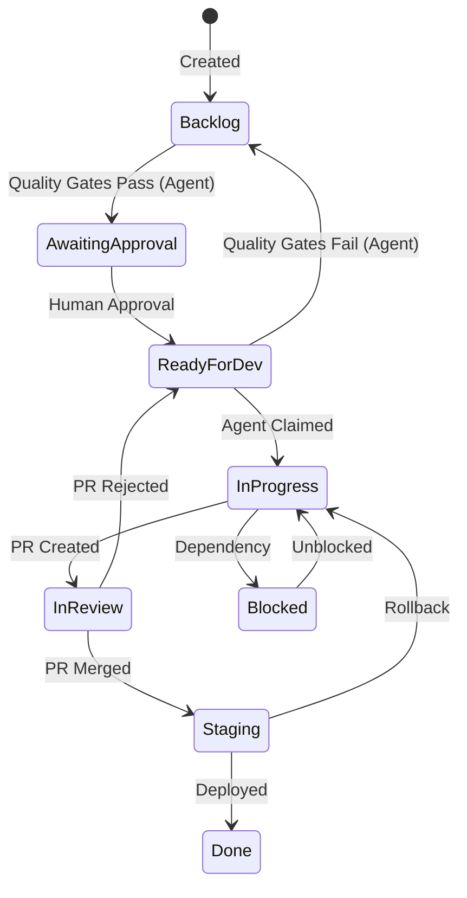

# Linear Integration Strategy for Autonomous PR System

## 🎯 Objective

Safely and intelligently process Linear backlog items through autonomous PR creation, with focus on:
- Issue selection intelligence
- Progress tracking
- Feedback loops
- Risk management

---

## 📊 Linear Workflow Configuration

### Issue States & Transitions



### Workflow Authority Rules

**What Agents CAN Do**:
- ✅ Move issues from `Backlog` → `Backlog` (estimate & refine)
- ✅ Move issues from `Backlog` → `Awaiting Approval` (when quality gates pass)
- ✅ Move issues from `Ready for Dev` → `Backlog` (when quality gates fail)
- ✅ Move issues from `Ready for Dev` → `In Progress` (claim for work)
- ✅ Move issues from `In Progress` → `In Review` (PR created)
- ✅ Move issues from `In Review` → `Staging` (PR merged)

**What Agents CANNOT Do**:
- ❌ Move issues from `Backlog` → `Ready for Dev` (requires human prioritization)
- ❌ Move issues from `Awaiting Approval` → `Ready for Dev` (requires human approval)
- ❌ Assign issues to humans
- ❌ Delete or archive issues
- ❌ Modify user-created issues without permission

### Custom Fields for Automation

```yaml
automation_fields:
  auto_pr_safe:
    type: boolean
    description: "Issue is safe for autonomous PR"
    default: false
  
  complexity_score:
    type: number
    description: "Estimated complexity (1-5)"
    validation: "min: 1, max: 5"
  
  estimate:
    type: number
    description: "Story points (Fibonacci: 1,2,3,5,8,13,21)"
    validation: "values: [1,2,3,5,8,13,21]"
    required: true
  
  ai_confidence:
    type: number
    description: "Agent confidence in successful completion"
    validation: "min: 0, max: 100"
  
  last_agent_attempt:
    type: datetime
    description: "Timestamp of last automation attempt"
  
  agent_notes:
    type: text
    description: "Internal notes from agents"
  
  rollback_count:
    type: number
    description: "Number of rollbacks for this issue"
  
  created_by_ai:
    type: boolean
    description: "Issue created by AI agent"
    default: false
```

### Quality Gate Requirements

For an issue to move from `Backlog` → `Awaiting Approval`, it must have:

1. **🔢 Fibonacci Estimate** (1,2,3,5,8,13,21) - MANDATORY
   - No issue proceeds without proper estimation
   - Estimates must follow Fibonacci sequence

2. **📋 Acceptance Criteria** - MANDATORY
   - Clear, testable conditions
   - Formatted as checklist items
   - No ambiguous requirements

3. **📝 Technical Details** - MANDATORY
   - Implementation context provided
   - Dependencies identified
   - Potential risks noted

4. **🎯 Unambiguous Requirements** - MANDATORY
   - Single interpretation possible
   - High developer confidence
   - No conflicting requirements

---

## 🤖 Backlog Processing Algorithm

### Issue Selection Criteria

```python
class LinearIssueSelector:
    def score_issue(self, issue: LinearIssue) -> float:
        score = 0.0
        
        # Priority weighting
        priority_weights = {
            "urgent": 5.0,
            "high": 3.0,
            "medium": 2.0,
            "low": 1.0
        }
        score += priority_weights.get(issue.priority, 1.0)
        
        # Complexity penalty
        complexity_penalty = {
            1: 0.0,   # Simple
            2: -0.5,  # Easy
            3: -1.0,  # Medium
            4: -2.0,  # Hard
            5: -5.0   # Complex
        }
        score += complexity_penalty.get(issue.complexity_score, -3.0)
        
        # Recency bonus (prefer newer issues)
        days_old = (datetime.now() - issue.created_at).days
        score += max(0, 5.0 - (days_old * 0.1))
        
        # Previous failure penalty
        score -= issue.rollback_count * 2.0
        
        # Team velocity consideration
        if issue.estimate and self.team_velocity:
            if issue.estimate <= self.team_velocity * 0.2:
                score += 1.0  # Quick wins
        
        return max(0, score)
```

### Safety Filters

```python
class SafetyFilter:
    UNSAFE_PATTERNS = [
        # File patterns
        r".*\.sql$",           # Database migrations
        r".*auth.*",           # Authentication files
        r".*payment.*",        # Payment processing
        r".*\.env.*",          # Environment configs
        r".*secret.*",         # Secrets management
        
        # Code patterns
        r"DELETE\s+FROM",      # Data deletion
        r"DROP\s+TABLE",       # Schema changes
        r"\.env\[",            # Env var access
        r"stripe\.",           # Payment API
        r"jwt\.",              # Auth tokens
    ]
    
    def is_safe_issue(self, issue: LinearIssue) -> bool:
        # Must have explicit safe flag
        if not issue.auto_pr_safe:
            return False
        
        # Check description for unsafe patterns
        for pattern in self.UNSAFE_PATTERNS:
            if re.search(pattern, issue.description, re.IGNORECASE):
                return False
        
        # Check linked PRs for past problems
        if issue.rollback_count > 2:
            return False
        
        # Verify clear acceptance criteria
        if not self.has_clear_criteria(issue):
            return False
        
        return True
```

---

## 📈 Linear Backlog Population Strategy

### Phase 1: Seeding Safe Issues

```python
class BacklogSeeder:
    SAFE_ISSUE_TEMPLATES = [
        {
            "title": "Add loading states to {component}",
            "description": "Add proper loading indicators",
            "labels": ["ui", "auto-pr-safe"],
            "complexity": 1,
            "estimate": 1
        },
        {
            "title": "Fix typo in {file}",
            "description": "Correct spelling/grammar",
            "labels": ["documentation", "auto-pr-safe"],
            "complexity": 1,
            "estimate": 0.5
        },
        {
            "title": "Add unit tests for {function}",
            "description": "Increase test coverage",
            "labels": ["testing", "auto-pr-safe"],
            "complexity": 2,
            "estimate": 2
        },
        {
            "title": "Update dependencies in {package}",
            "description": "Bump patch versions only",
            "labels": ["maintenance", "auto-pr-safe"],
            "complexity": 2,
            "estimate": 1
        }
    ]
```

### Phase 2: Intelligent Issue Creation

```python
class ProspectAgent:
    async def create_linear_issue(self, problem: Problem) -> LinearIssue:
        # Generate issue from identified problem
        issue_data = {
            "title": self.generate_title(problem),
            "description": self.generate_description(problem),
            "priority": self.calculate_priority(problem),
            "labels": self.suggest_labels(problem),
            "estimate": self.estimate_effort(problem),
            
            # Automation metadata
            "auto_pr_safe": self.evaluate_safety(problem),
            "complexity_score": self.assess_complexity(problem),
            "ai_confidence": self.prediction_confidence(problem),
        }
        
        # Create in Linear
        issue = await linear_client.create_issue(issue_data)
        
        # Add to learning dataset
        self.track_issue_creation(issue, problem)
        
        return issue
```

---

## 🔄 Feedback Integration

### Success Tracking

```python
@dataclass
class IssueOutcome:
    issue_id: str
    pr_url: str
    time_to_complete: timedelta
    deployment_status: str
    post_deploy_errors: int
    user_feedback: Optional[str]
    
    @property
    def success_score(self) -> float:
        score = 1.0
        
        # Time efficiency
        if self.time_to_complete < timedelta(hours=2):
            score += 0.2
        elif self.time_to_complete > timedelta(hours=8):
            score -= 0.3
            
        # Deployment success
        if self.deployment_status == "success":
            score += 0.3
        else:
            score -= 0.5
            
        # Error rate
        score -= self.post_deploy_errors * 0.1
        
        return max(0, min(1, score))
```

### Linear Updates

```python
class LinearFeedbackLoop:
    async def update_issue_metadata(self, outcome: IssueOutcome):
        issue = await linear_client.get_issue(outcome.issue_id)
        
        # Update custom fields
        updates = {
            "ai_confidence": self.recalculate_confidence(
                issue.ai_confidence, 
                outcome.success_score
            ),
            "agent_notes": self.append_outcome_notes(
                issue.agent_notes,
                outcome
            )
        }
        
        # Add comment with results
        comment = self.format_outcome_comment(outcome)
        await linear_client.add_comment(issue.id, comment)
        
        # Update labels based on outcome
        if outcome.success_score > 0.8:
            await linear_client.add_label(issue.id, "ai-success")
        elif outcome.success_score < 0.3:
            await linear_client.add_label(issue.id, "ai-needs-human")
```

---

## 📊 Monitoring & Dashboards

### Linear Analytics Queries

```graphql
# Issues ready for automation
query AutomationReadyIssues {
  issues(
    filter: {
      state: { name: { eq: "Ready" } }
      labels: { name: { eq: "auto-pr-safe" } }
      customFields: {
        complexity_score: { lte: 3 }
        rollback_count: { lt: 2 }
      }
    }
    orderBy: priority
  ) {
    nodes {
      id
      title
      priority
      estimate
      complexity_score
      ai_confidence
    }
  }
}

# Automation performance metrics
query AutomationMetrics($startDate: DateTime!) {
  issues(
    filter: {
      labels: { name: { eq: "auto-pr-safe" } }
      completedAt: { gte: $startDate }
    }
  ) {
    nodes {
      id
      title
      completedAt
      createdAt
      customFields {
        ai_confidence
        rollback_count
      }
      linkedPullRequests {
        url
        mergedAt
      }
    }
  }
}
```

### KPI Dashboard

```python
class LinearAutomationDashboard:
    def calculate_kpis(self) -> Dict[str, Any]:
        return {
            "automation_velocity": {
                "issues_per_day": self.completed_per_day(),
                "avg_time_to_complete": self.avg_completion_time(),
                "success_rate": self.successful_deploys_ratio(),
            },
            "backlog_health": {
                "ready_for_automation": self.count_ready_issues(),
                "blocked_issues": self.count_blocked(),
                "avg_complexity": self.average_complexity(),
            },
            "learning_metrics": {
                "confidence_trend": self.confidence_over_time(),
                "retry_rate": self.calculate_retry_rate(),
                "human_intervention_rate": self.intervention_ratio(),
            }
        }
```

---

## 🚦 Progressive Rollout Plan

### Week 1: Documentation & UI Polish
- Target issues: Typos, missing docs, UI inconsistencies
- Expected volume: 5-10 issues/day
- Risk level: Minimal

### Week 2: Test Coverage
- Target issues: Missing unit tests
- Expected volume: 3-5 issues/day  
- Risk level: Low

### Week 3: Dependency Updates
- Target issues: Patch version bumps
- Expected volume: 2-3 issues/day
- Risk level: Low-Medium

### Week 4: Bug Fixes
- Target issues: Simple, well-defined bugs
- Expected volume: 2-4 issues/day
- Risk level: Medium

### Week 5: Small Features
- Target issues: UI components, utilities
- Expected volume: 1-2 issues/day
- Risk level: Medium-High

---

## 🔐 Emergency Procedures

### Automatic Circuit Breakers

```python
class LinearCircuitBreaker:
    def __init__(self):
        self.failure_threshold = 3
        self.cooldown_period = timedelta(hours=1)
        
    async def check_health(self):
        recent_issues = await self.get_recent_automated_issues()
        
        failures = sum(1 for i in recent_issues if i.rollback_count > 0)
        
        if failures >= self.failure_threshold:
            await self.pause_automation()
            await self.alert_team(
                f"Automation paused: {failures} failures detected"
            )
            return False
            
        return True
```

### Manual Override Commands

```bash
# Pause all automation
linear-agent pause --reason "Investigating issues"

# Resume with constraints
linear-agent resume --max-complexity 2 --limit 5

# Rollback recent changes
linear-agent rollback --hours 4 --target staging

# Generate report
linear-agent report --period week --format slack
```

---

## 📚 Best Practices

1. **Start Small**: Begin with trivial issues to build confidence
2. **Monitor Closely**: Watch the first 100 automated PRs carefully
3. **Iterate Quickly**: Adjust selection criteria based on outcomes
4. **Communicate**: Keep the team informed of automation progress
5. **Learn Continuously**: Use every failure as a learning opportunity
6. **Respect Limits**: Never bypass safety constraints for speed

---

## 🎯 Success Criteria

### Month 1
- ✅ 50+ issues automatically resolved
- ✅ <5% rollback rate
- ✅ 80% team satisfaction

### Month 3  
- ✅ 200+ issues completed
- ✅ 2x velocity improvement
- ✅ Handling 30% of backlog

### Month 6
- ✅ 1000+ issues resolved
- ✅ Self-improving system
- ✅ 50% of routine work automated 